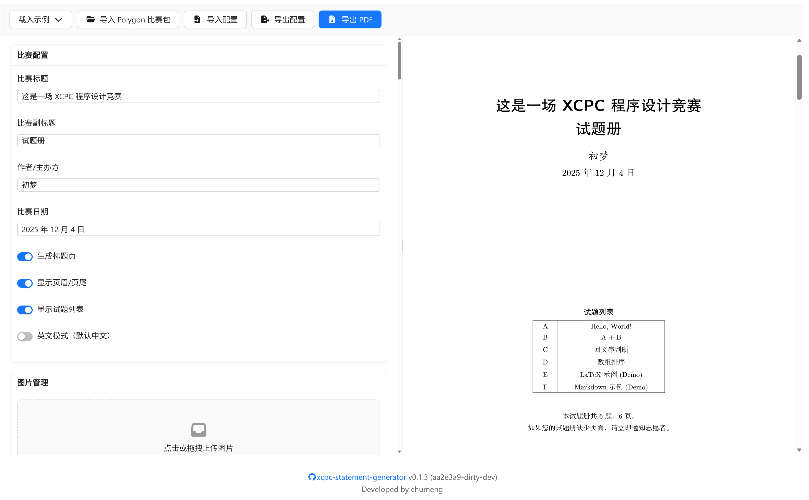

# XCPC Statement Generator

[](https://github.com/lihaoze123/xcpc-statement-generator)
[](https://github.com/lihaoze123/xcpc-statement-generator/releases/latest)
[>)](https://github.com/lihaoze123/xcpc-statement-generator/commits/main/)
[](https://deepwiki.com/lihaoze123/xcpc-statement-generator)

**[English](README.md) | [中文(Chinese)](README.cn.md)**

一个基于 Web 的 XCPC 竞赛题目册生成器，支持在浏览器中将 Typst/Markdown/LaTeX 格式的题目转化为专业的 XCPC 风格 PDF 文件。



## ✨ 特性

- **🌐 浏览器原生运行**：无需后端服务器，完全在浏览器中运行
- **📦 Polygon 包导入**：支持直接导入 Codeforces Polygon 系统导出的比赛包
- **📝 多格式支持**：支持 Typst、Markdown、LaTeX 三种题面格式
- **⚡ 实时预览**：即时编译预览，所见即所得
- **🎨 专业排版**：几乎像素级复刻 XCPC 竞赛的题目册样式
- **🔧 灵活配置**：支持自定义竞赛信息、题目列表等元数据
- **📄 单题导出**：支持将单个题目导出为独立 PDF 文件
- **📱 移动端支持**：响应式布局，底部导航适配移动设备
- **📚 版本控制**：支持保存、恢复和对比竞赛版本
- **🔍 Vim 模式**：代码编辑器可选 Vim 键位

## 🚀 快速开始

### 使用 Polygon 包导入

1. 在 Codeforces Polygon 系统中导出比赛包（ZIP 格式）
2. 在应用中点击 **"导入 Polygon 包"** 按钮
3. 选择下载的 ZIP 文件，等待解析完成
4. 编辑和完善题目信息，导出 PDF 文件

### 本地开发

```bash
# 克隆项目
git clone https://github.com/lihaoze123/xcpc-statement-generator.git
cd xcpc-statement-generator

# 在 vite.config.ts 中配置 base 项为 ./

# 安装依赖
npm install

# 启动开发服务器
npm run dev

# 构建生产版本
npm run build

# 预览生产构建
npm run preview
```

## 🤝 贡献

欢迎提交 Issue 和 Pull Request！

## 📄 许可证

本项目采用 AGPL 3.0 许可证，详见 [LICENSE](LICENSE) 文件。

## 🙏 致谢

- 灵感来源于 [cnoi-statement-generator](https://github.com/Mr-Python-in-China/cnoi-statement-generator) （部分代码有参考）
- 感谢 Typst 社区提供的优秀编译器
